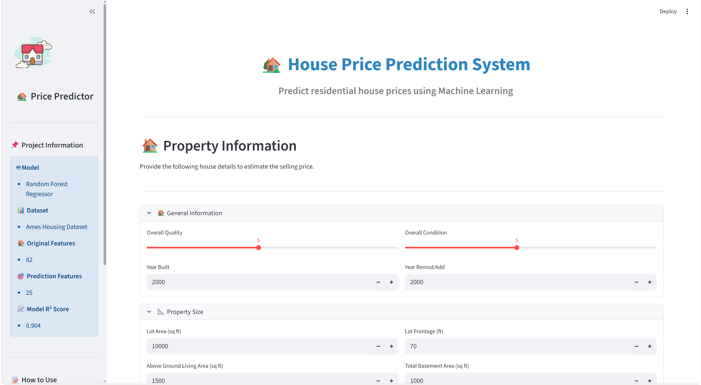
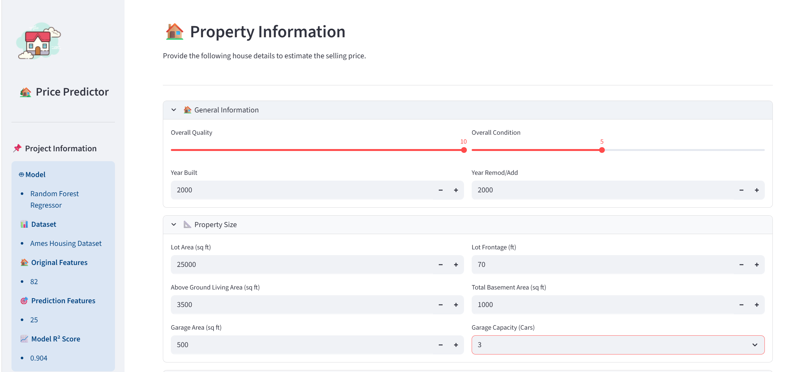
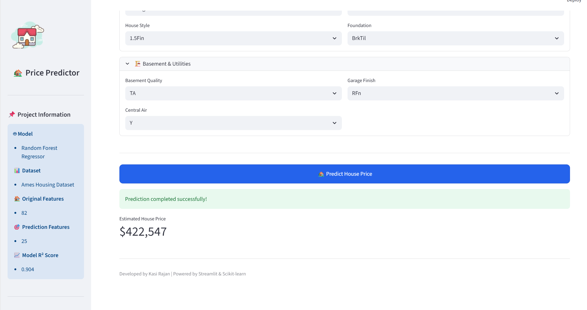

# 🏡 House Price Prediction System

A Machine Learning web application that predicts residential house prices using the Ames Housing Dataset.

Built with **Python**, **Scikit-learn**, and **Streamlit**.

---

# 📸 Application Preview

## 🏠 Home Page



---

## ✍️ Input Form



---

## 📈 Prediction Result



---

## 📌 Project Overview

## 📌 Project Overview

This project predicts the selling price of a house using a trained Random Forest Regression model.

Users can enter various house characteristics such as:

- Overall Quality
- Overall Condition
- Year Built
- Living Area
- Basement Area
- Garage Details
- Bathrooms
- Bedrooms
- Neighborhood
- House Style
- And more...

The application instantly predicts the estimated selling price.

---

## 🚀 Features

- Interactive Streamlit Web App
- Real-time House Price Prediction
- Random Forest Regression Model
- Clean and User-Friendly Interface
- Feature Engineering Pipeline
- Responsive Sidebar
- Organized Input Sections
- Professional Dashboard Design

---

## 📊 Dataset

- **Dataset:** Ames Housing Dataset
- **Records:** 2,930 Houses
- **Original Features:** 82
- **Prediction Features Used:** 25

---

## 🛠️ Tech Stack

- Python
- Pandas
- NumPy
- Scikit-learn
- Joblib
- Streamlit

---

## 📈 Model Performance

| Metric | Score |
|---------|-------|
| Model | Random Forest Regressor |
| R² Score | 0.904 |
| MAE | ~15,887 |
| RMSE | ~27,766 |

---

## 📂 Project Structure

```text
House-Price-Prediction/
│
├── app.py
├── README.md
├── requirements.txt
├── assets/
├── data/
├── models/
├── notebooks/
└── src/
```

---

## ▶️ Installation

Clone the repository:

```bash
git clone <https://github.com/Kasirajan93/House-Price-Prediction-System.git>
```

Move into the project folder:

```bash
cd House-Price-Prediction
```

Install dependencies:

```bash
pip install -r requirements.txt
```

Run the application:

```bash
streamlit run app.py
```

---

## 👨‍💻 Developer

**Kasi Rajan**

- Python Developer
- Machine Learning Enthusiast
- Data Science Portfolio Project

---

## ⭐ Future Improvements

- XGBoost Model Comparison
- Feature Importance Visualization
- Batch Prediction
- Cloud Deployment
- Model Monitoring

---

## 📜 License

This project is created for educational and portfolio purposes.